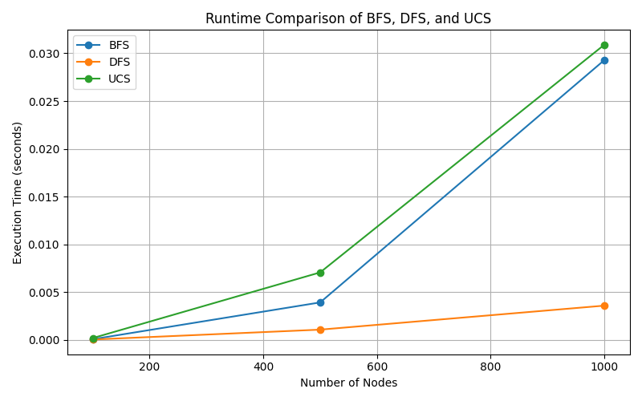

<h1 align="center">Uninformed Search Comparison</h1>

<div align="center">

&nbsp;
&nbsp;
&nbsp;

</div>

<p align="center">A comparative analysis of <code>BFS</code>, <code>DFS</code>, and <code>UCS</code> — three classical uninformed search algorithms in Artificial Intelligence.</p>

---

## Table of Contents

-   [Introduction](#introduction)
    -   [Background](#background)
    -   [Problem Statement](#problem-statement)
-   [Theory Review](#theory-review)
-   [Analyisis and Implemenation](#analysis-and-implementation)
-   [Case Studies and Results](#case-studies-and-results)
    -   [Dataset](#dataset)
    -   [Visualization](#visualization)
    -   [Result Analysis](#result-analysis)
-   [Conclusion and Recommendations](#conclusions-and-recommendations)
-   [Choose BFS or DFS or UCS?](#choose-bfs-or-dfs-or-ucs)
-   [Real-World Application](#real-world-application)
    -   [Breadth-First Search (BFS)](#breadth-first-search-bfs)
        -   [Concept BFS](#concept-bfs)
        -   [Characteristics BFS](#characteristics-bfs)
        -   [Application BFS](#application-bfs)
    -   [Depth-First Search (DFS)](#depth-first-search-dfs)
        -   [Concept DFS](#concept-dfs)
        -   [Characteristics DFS](#characteristics-dfs)
        -   [Application DFS](#application-dfs)
    -   [Uniformed-Cost Search (UCS)](#uniform-cost-search-ucs)
        -   [Concept UCS](#concept-ucs)
        -   [Characteristics UCS](#characteristic-ucs)
        -   [Application UCS](#application-ucs)
-   [Installation on Linux](#installation-on-linux)
-   [Installation on Windows](#installation-on-windows)

---

## Introduction

### Background

Uninformed search forms the foundation of Artificial Intelligence in solving problems without additional heuristic information. Algorithms such as **Breadth-First Search (BFS)**, **Depth-First Search (DFS)**, and **Uniform-Cost Search (UCS)** are designed to explore the _state space_ and determine a valid or optimal path to a goal.

### Problem Statement

How can we compare the performance of `BFS`, `DFS`, and `UCS` based on execution time and computational complexity?

---

## Theory Review

-   The concept of state space and how problems are represented in AI
-   Here are the brief explanation of each algorithm:
    -   `BFS`: level-by-level exploration (FIFO - First In First Out using Queue or Horizontal)
    -   `DFS`: explore as deep as possible (LIFO - Last In First Out using Stack or Vertical)
    -   `UCS`: Exploration based on minimum cumulative cost (priority queue or open and close condition)
-   Theoritical analysis:
    -   Completeness: whether the algorithm guarantees a solution.
    -   Optimality: whether the found solution is the bset (minimum cost or steps).
    -   Time and Space Complexity: how performance scales with branching factor and depth

---

## Analysis and Implementation

-   Graph generation uses the `networkx` library with random edges and optional weights.
-   Algorithms `BFS`, `DFS`, and `UCS` were implemented **from scratch** (no built-in pathfinding).
-   Runtime was measured using the Python `time` module for fair performance comparison.

---

## Case Studies and Results

-   Graph with `100`, `500`, and `1000` nodes

```python
sizes = [100, 500, 1000]
```

### Dataset

Experiments were conducted on random graphs with `100`, `500`, and `1000` nodes.

-   Display runtime results (tables & graph)

| Nodes | BFS (s)               | DFS (s)                | UCS (s)                |
| ----- | --------------------- | ---------------------- | ---------------------- |
| 100   | 7.748603820800781e-05 | 3.7670135498046875e-05 | 5.9604644775390625e-05 |
| 500   | 0.0036003589630126953 | 0.0009903907775878906  | 0.006604671478271484   |
| 1000  | 0.030124425888061523  | 0.004039764404296875   | 0.03344416618347168    |

### Visualization



### Result Analysis

-   `BFS` is slower as it explores all nodes at each level, but it guarantees finding the shortest path (if costs are uniform)
-   `DFS` executes fastest because it only explores one deep path at a time, but it may miss the optimal solution.
-   `UCS` is the slowest because it must repeatedly reorder the priority queue by cumulative path cost, ensuring the lowest-cost solution.

## Conclusions and Recommendations

| Algorithm | Advantages                                      | Disadvantages                                    |
| --------- | ----------------------------------------------- | ------------------------------------------------ |
| BFS       | Complete and finds optimal path (if equal cost) | High memory usage for large graphs               |
| DFS       | Fast and memory-efficient                       | Not guaranteed to find the optimal solution      |
| UCS       | Always finds the minimum-cost path.             | High computational overhead and slower execution |

> [!NOTE]
> While `BFS` and `UCS` require more memory, this limitation is less critical today due to larger available system resources. The key factor is still whether we prioritize speed or optimality.

### Choose BFS or DFS or UCS?

The answer is depends on the situation

1. Choose `BFS` if

-   Always need optimal solution
-   Doesn't have any issue on memory capacity

2. Choose `DFS` if

-   Not always need optimal solution
-   Have limitation on memory capacity

3. Choose `UCS` if

-   Want to find the optimal solution with cost effective
-   If have different weight on each edge or node

---

## Real-World Application

### Breadth-First Search (BFS)

#### Concept BFS

BFS explores nodes level by level, ensuring that the shallowest node (or shortest path) is found first. It guarantees finding the **shortest path** when all edges have equal cost.

#### Characteristics BFS

-   Use **Queue (FIFO)** data structure
-   **Complete:** will always find a solution if one exists
-   **Optimal:** when all edge costs are equal

#### Application BFS

| Domain               | Example                                           | Description                                                                     |
| -------------------- | ------------------------------------------------- | ------------------------------------------------------------------------------- |
| **Game Pathfinding** | NPC movement in 2D games (_Pac-Man_, _Bomberman_) | Ensures shortest route from start to goal in a grid map.                        |
| **Puzzle Solving**   | 8-Puzzle or sliding tile games                    | Finding the minimal number of moves to reach the goal configuration.            |
| **Social Networks**  | "Friend of a Friend" recommendation systems       | Finds the shortest connection path between two users in a social graph.         |
| **AI Planning**      | Non-weighted navigation in simple environments    | Useful for path exploration in grid-based maps where all steps have equal cost. |

> [!NOTE]
> Analogy: BFS is like searching for a key by checking every room on the first floor before going upstairs - systematic and thorough.

### Depth-First Search (DFS)

#### Concept DFS

DFS dives deep along one branch before backtracking to explore others. It is **fast and memory-efficient**, but may get stuck in long or infinite branches.

#### Characteristics DFS

-   Uses **Stack (LIFO)** data structure
-   **Incomplete** for infinite state spaces
-   **Not Optimal** - may find suboptimal solutions

#### Application DFS

| Domain                    | Example                                | Description                                                                         |
| ------------------------- | -------------------------------------- | ----------------------------------------------------------------------------------- |
| **Maze Solving**          | Robot or agent solving a maze          | Explores path deeply and backtracks when hitting a dead end.                        |
| **Game Tree Exploration** | Tic-Tac-Toe, Chess (early move search) | Explores one branch of possible moves before evaluating alternatives.               |
| **Compiler Design**       | Abstract Syntax Tree (AST) traversal   | DFS is used to explore hierarchical program structures.                             |
| **Web Crawling (Simple)** | Crawling websites recursively          | DFS can be used to traverse pages but needs depth limits to prevent infinite loops. |

> [!NOTE]
> Analogy: DFS is like walking down one hallway until it ends, then going back to try the next hallway.

---

### Uniform-Cost Search (UCS)

#### Concept UCS

UCS generalizes BFS for **weighted graphs**, where each edge has a cost. It always expands the **lowest cumulative cost** path first, ensuring the most efficient route.

#### Characteristic UCS

-   Uses **Priority Queue (Min-Heap)**
-   **Complete and Optimal** (when all costs are positive)
-   Slower but guarantees the **lowest-cost solution**

#### Application UCS

| Domain                     | Example                                    | Description                                                              |
| -------------------------- | ------------------------------------------ | ------------------------------------------------------------------------ |
| **Navigation Systems**     | Google Maps, Waze, GPS routing             | Finds the path with the shortest distance or least travel time.          |
| **Robot Motion Planning**  | Path optimization for autonomous robots    | Choose the route with minimum energy or movement cost.                   |
| **Logistics Optimization** | Delivery or transport cost minimization    | Finds the most cost-efficient delivery route between multiple points.    |
| **Strategy Games**         | AI movement in terrain with variable costs | Determines best route where terrains have different travel difficulties. |

> [!NOTE]
> Analogy: UCS is like choosing a driving route that minimizes total fuel cost, not just distance.

## Installation on Linux

1. Clone the repository:

    ```bash
    git clone https://github.com/armandwipangestu/uninformed-search-comparison
    cd uninformed-search-comparison

    sudo apt install python3-venv
    python -m venv venv
    source venv/bin/activate
    ```

2. Install required dependencies:

    ```bash
    pip install -r requirements.txt
    ```

3. Running the script:

    ```bash
     # Run the experiment
     python src/main.py

     # Show visualize
     python src/plot_result.py
    ```

## Installation on Windows

1. Clone the repository:

    ```bash
    git clone https://github.com/armandwipangestu/uninformed-search-comparison
    cd uninformed-search-comparison

    python -m venv venv
    . .\venv\Scripts\Activate.ps1
    ```

2. Install required dependencies:

    ```bash
    pip install -r requirements.txt
    ```

3. Running the service:

    ```bash
     # Run the experiment
     python src/main.py

     # Show visualize
     python src/plot_result.py
    ```
